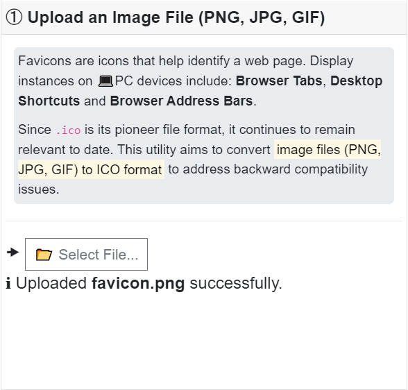
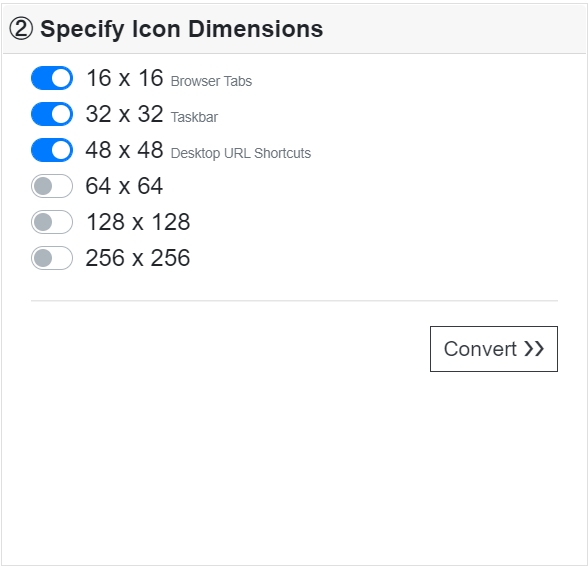
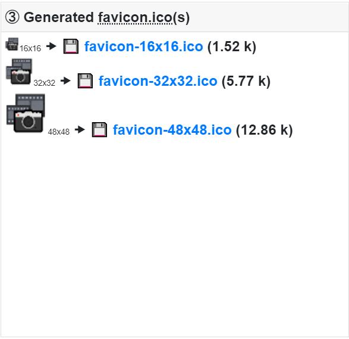

# Custom Favicon Generator
### Based on Original Plugin at 🔗<a href="https://png2icojs.com/" target="_blank">PNG to ICO Icon Format</a>
## Objective: Convert Image formats (PNG, JPG, GIF) to ICO format
 

### 1. Upload an Image File (PNG, JPG, GIF)
 
---
### 2. Specify Icon Dimensions
 
---
### 3. Generated favicon.ico(s)
 